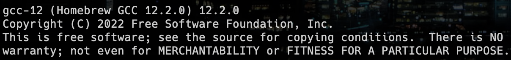

# Design and Analysis of Algorithms

This repository contains all the C programs that I have executed in my Design and Analysis of Algorithms course for my 3rd Year of Undergrad in Computer Science at Dayananda Sagar University, Bengaluru, India in Q4 2022.

## List of Programs

| Serial No. | C File Name | Description |
| :---: | :--- | :--- |
| 1  | [1_towerOfHanoi.c](https://github.com/rexgraystone/daa/blob/master/1_towerOfHanoi.c)  | A C program to implement Tower of Hanoi using recursion. |
| 2  | [2_binarySearch.c](https://github.com/rexgraystone/daa/blob/master/2_binarySearch.c)  | A program to search for a key element in an array using binary search algorithm. |
| 3  | [3_mergeSort.c](https://github.com/rexgraystone/daa/blob/master/3_mergeSort.c)  | A C program to sort an array using Merge Sort Algorithm. |
| 4  | [4_quickSort.c](https://github.com/rexgraystone/daa/blob/master/4_quickSort.c)  | A C program to sort an array using Quick Sort Algorithm. |
| 5  | [5_primsAlgorithm.c](https://github.com/rexgraystone/daa/blob/master/5_primsAlgorithm.c)  | A C program to find the Minimum Cost Spanning Tree of a given graph using Prim's Algorithm. |
| 6  | [6_kruskalsAlgorithm.c](https://github.com/rexgraystone/daa/blob/master/6_kruskalsAlgorithm.c)  | A C program to find the Minimum Cost Spanning Tree of a given graph using Kruskal's Algorithm. |

## Miscellaneous Programs

| Serial No. | C File Name | Description |
| :---: | :--- | :--- |
| 1  | [M_printFactorial.c](https://github.com/rexgraystone/daa/blob/master/M_printFactorial.c)  | Write a C program to find the factorial of a number using Recursion. |

## How to Run

1. Ensure that you have a C compiler installed on your system.

    ```bash
    gcc --version
    ```

    It should look something like this 

    If you don't have a C compiler installed, you can download one from [here](https://sourceforge.net/projects/mingw/) or using your package manager.

    Examples:

    - Ubuntu -

    ```bash
    sudo apt install gcc
    ```

    - Arch Linux -

    ```bash
    sudo pacman -S gcc
    ```

    - macOS -

    ```bash
    brew install gcc
    ```

    Additionaly, if you are using Windows, follow the steps specified [here](https://www.scaler.com/topics/c/c-compiler-for-windows/).

2. Clone the repository using the following command:

    ``` bash
    gh repo clone rexgraystone/daa
    ```

    or

    ``` bash
    git clone https://github.com/rexgraystone/daa.git
    ```

3. Change the directory to the cloned repository:

    ``` bash
    cd daa
    ```

4. Compile the C program using the following command:

    ``` bash
    gcc <C File Name> -o <Output File Name>
    ```

5. Run the program using the following command:

    ``` bash
    ./<Output File Name>
    ```

### Note

The programs are written in C and compiled using GCC compiler on macOS Ventura 13.0.
